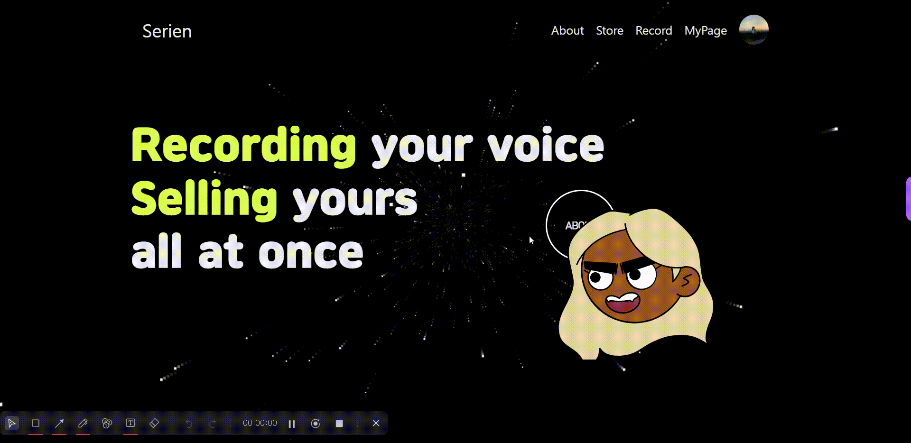

# Seiren

- AI Voice 학습 및 거래 플랫폼

# 목차

1. [결과물](#결과물)
2. [서비스 화면](#서비스-화면)
3. [주요 기능](#주요-기능)
4. [개발 환경](#개발-환경)
5. [기술 소개](#기술-소개)
6. [설계 문서](#설계-문서)
7. [팀원 소개](#팀원-소개)

# 결과물

- 📽 [UCC](https://youtu.be/o2EBLNdY8w4)

- 🎤 [중간발표 자료](https://drive.google.com/file/d/1COA8hVxKce2ITqUMMZi81D2oJvRxbZyO/view?usp=sharing)

- 🎤 [최종발표 자료](https://drive.google.com/file/d/1Zd7H1pnseM33wLsKeWNzw6r47Dtfco3s/view?usp=sharing)

## Main Page

 

 

- 메인페이지. 네브바에 각 페이지로 갈 수 있는 링크들이 있음.
- 사이트의 대략적인 느낌을 얻을 수 있습니다.

## About Page

 

 

- 플랫폼에 대한 자세한 설명이 적혀있는 페이지
- 역동적인 효과로 시선을 끈다.
- 플랫폼의 주요 기능을 다루고 바로 이동할 수 있게 도와준다.
- 또한, UCC를 바로 볼 수 있다.

## Store Page

 

 

- 학습된 AI-Voice를 상품 등록 하면 해당 페이지에서 판매가 가능하다.
- 상품 등록된 여러가지 목소리를 열람할 수 있다.
- 검색 기능을 통해 상품들을 필터링하여 볼 수 있다.

## Store Detail Page

 

 

- 선택한 목소리의 정보를 볼 수 있다.
- 등록된 3가지의 미리듣기 문장을 들을 수 있다.
- 최대 20자의 체험하기 기능을 제공한다.
- 구매하기 버튼을 통해 글자 단위로 구매가 가능하다.

 

 

- 구매하기를 누를 시 글자 단위로 구매가 가능하다
- 구매를 하게되면 바로 사용이 가능하게 사용 페이지로 연결된다.

## Voice Study Page

 

 

- 녹음을 하기 전 Voice 정보를 먼저 등록한다.
- 제공된 문장을 통해 녹음을 진행합니다.

 

 

- 충분한 녹음이 완료되면 목소리 학습이 활성화 됩니다.
- 녹음된 파일을 통해 AI-Voice 모델을 생성합니다.

## Voice Study Page

 

 

- 녹음을 하기 전 Voice 정보를 먼저 등록한다.
- 제공된 문장을 통해 녹음을 진행합니다.

 

 

- 충분한 녹음이 완료되면 목소리 학습이 활성화 됩니다.
- 녹음된 파일을 통해 AI-Voice 모델을 생성합니다.

# 주요 기능

- ##### 1. 알림 기능
  
  - ###### D-day 에 따른 알림
  - ###### 예약 및 스케쥴에 따른 알림
  - ###### 다이어리 작성에 따른 알림

- ##### 2. 다이어리 기능
  
  - ###### 내 다이어리
  
  - ###### 약혼자 다이어리

- ##### 3. 모바일 청첩장
  
  - ###### 작성 후 카카오톡을 이용한 공유

# 개발 환경

## ⚙ Management Tool

- 형상 관리 : Gitlab
- 이슈 관리 : Jira
- 커뮤니케이션 : Mattermost, Webex, Notion, Discord
- 디자인 : Figma, PowerPoint

## 💻 IDE

- Visual Studio Code `1.18.1`
- IntelliJ `11.0.19`

## 📱 Frontend

- React `18.2.0`
- Vite `^4.4.5`
- Recoil `^0.7.7`
- React-Router-Dom `6.14.2`
- Library
  - antd : `^5.7.3`
  - antd-mobile : `^5.32.0`
  - axios : `^1.4.0`
  - clipboard-copy : `^4.0.1`
  - dayjs : `^1.11.9`
  - framer-motion : `^10.13.0`
  - gsap : `^3.12.2`
  - qrcode : `^1.5.2`
  - react-calendar : `^4.5.0`
  - react-datepicker : `^4.16.0`
  - react-dom : `^18.2.0`
  - react-icons : `4.10.1`
  - react-infinite-scroll-component : `^6.1.0`
  - react-kakao-link : `^0.1.2`
  - react-loading-skeleton : `^3.3.1`
  - react-pageflip : `^2.0.3`
  - react-rating : `2.0.5`
  - react-responsice-carousel : `^3.2.23`
  - react-slick : `^0.29.0`
  - react-swipeable : `^7.0.1`
  - react-swipable-list : `^1.8.1`
  - slick-carousel : `^1.8.1`
  - styled-components : `^6.0.7`
- Flutter
  - library
    - inapp_webview
- Android Studio

## 💾 Backend

- Springboot `2.7.13`
- Lombok
- Spring Data JPA
- Spring Data Redis(lettuce)
- Spring Web
- Springdoc-openapi-ui `1.6.11`
- Oauth2
- Swagger 3.0.0
- Oauth2
- Redis
- MySql 8.0.34

## Infra

- AWS S3
- AWS EC2
- Nginx 1.18.0
- Docker 20.10.12
- Ubuntu 20.04.6 LTS
- CertBot(CA Certificates)
- SSL

# 기술 소개

- 웹 기반 하이브리드 어플리케이션
  
  - `Flutter`를 활용하여 웹 및 앱 플랫폼 모두 사용 가능

- 사용자 알림
  
  - `Firebase Cloud Message`를 이용하여 사용자에게 필요한 알림 제공, `Redis`를 이용한 FCM Token 관리

- 카카오 로그인
  
  - `OAUTH2` 인증을 이용해 불필요한 개인정보 입력 최소화

- 상품 실시간 예약 랭킹, 최근 본 상품
  
  - in-memory DB인 `Redis`의 sorted set 자료구조를 이용해 실시간 예약 랭킹과 사용자별 최근 본 상품 정보 제공

# 설계 문서

## 🎨 와이어프레임

## 📃 기능 명세서

## 📝 API 명세서

## 📏 ERD

## 📐 시스템 아키텍처

# 팀원 소개

| **[정훈석](https://github.com/AndreaStudy)**                                                          | **[정소정](https://github.com/sojeong025)**                                                           | **[구희영](https://github.com/hi9900)**                                                               | **[강동윤](https://github.com/yty455)**                                                               | **[김성인](https://github.com/ksi2564)**                                                              | **[김승연](https://github.com/ksy00826)**                                                             |
|:--------------------------------------------------------------------------------------------------:|:--------------------------------------------------------------------------------------------------:|:--------------------------------------------------------------------------------------------------:|:--------------------------------------------------------------------------------------------------:|:--------------------------------------------------------------------------------------------------:|:--------------------------------------------------------------------------------------------------:|
|  |  |  |  |  |  |
| Frontend                                                                                           | Frontend                                                                                           | Frontend                                                                                           | Backend                                                                                            | Backend                                                                                            | Backend                                                                                            |

## 😎 역할 분담

**Frontend**

- 정훈석 : 프론트 Token 처리 / Flutter / 카카오톡 공유하기 / 리액트 베이스 코드 제작 / 에러 수정
- 정소정 : UX/UI 설계 / PPT제작 / 영상 제작 / 발표 / 모바일 청첩장 페이지 제작
- 구희영 : UX/UI 설계 / PPT제작 / Route 설정 /회원 정보, 상품 정보, 마이페이지 제작

**Backend**

- 강동윤: Fluttter / infra 구축 / 다이어리, 찜하기, 도움돼요 API 제작

- 김성인 : DB설계 및 구축 / 회원(Oauth, JWT) 관련 API / S3 / 커플, 회원 등 API 제작

- 김승연 : 상품 크롤링 및 기타 API / FCM 알림 / Redis를 이용한 예약 랭킹 및 최근 본 상품 리스트 API 제작
