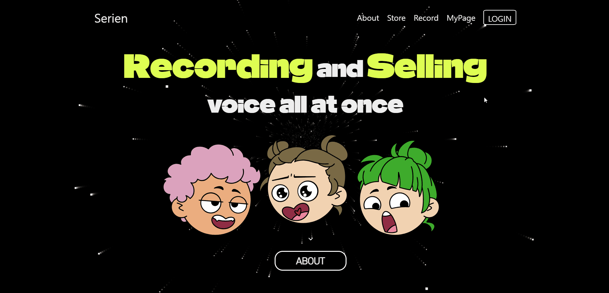
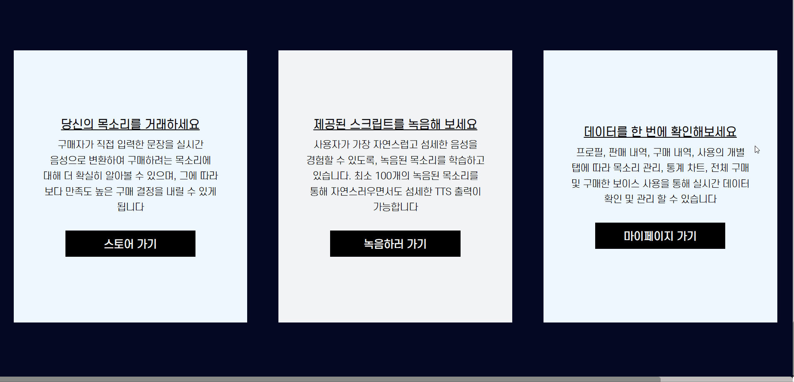
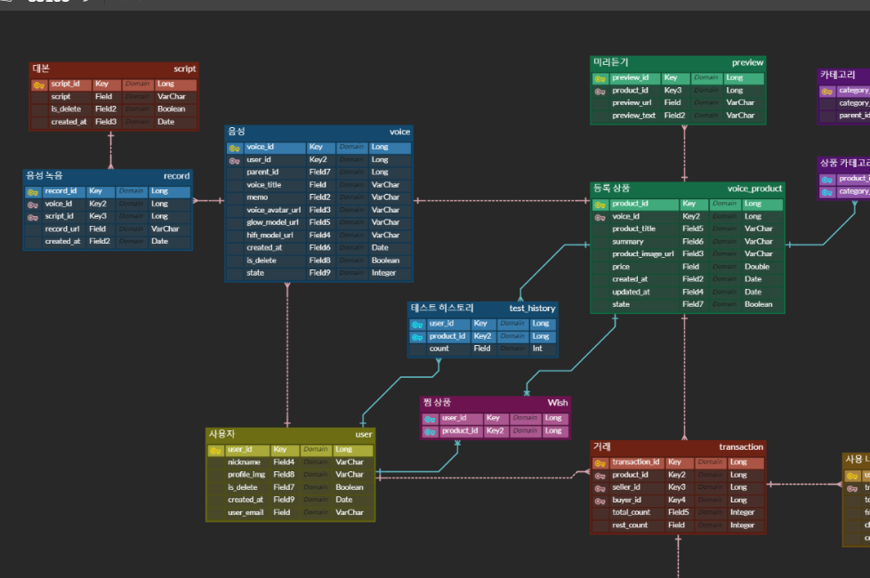

# Seiren

- AI Voice 학습 및 거래 플랫폼

# 목차

1. [결과물](#결과물)
2. [서비스 화면](#서비스-화면)
3. [주요 기능](#주요-기능)
4. [개발 환경](#개발-환경)
5. [기술 소개](#기술-소개)
6. [설계 문서](#설계-문서)
7. [팀원 소개](#팀원-소개)

# 결과물

- 📽 [UCC]()

- 🎤 [중간발표 자료]()

- 🎤 [최종발표 자료]()

## Main Page

 

 

- 메인페이지. 네브바에 각 페이지로 갈 수 있는 링크들이 있음.
- 사이트의 대략적인 느낌을 얻을 수 있습니다.

## Login Page

 

 

- 카카오 로그인 화면이다.
- 로그인 시 카카오 프로필을 받아온다.

## About Page

 

 

- 플랫폼에 대한 자세한 설명이 적혀있는 페이지
- 역동적인 효과로 시선을 끈다.
- 플랫폼의 주요 기능을 다루고 바로 이동할 수 있게 도와준다.
- 또한, UCC를 바로 볼 수 있다.

## Store Page

 

 

- 학습된 AI-Voice를 상품 등록 하면 해당 페이지에서 판매가 가능하다.
- 상품 등록된 여러가지 목소리를 열람할 수 있다.
- 검색 기능을 통해 상품들을 필터링하여 볼 수 있다.

## Store Detail Page

 

 

- 선택한 목소리의 정보를 볼 수 있다.
- 등록된 3가지의 미리듣기 문장을 들을 수 있다.
- 최대 20자의 체험하기 기능을 제공한다.
- 구매하기 버튼을 통해 글자 단위로 구매가 가능하다.

 

 

- 구매하기를 누를 시 글자 단위로 구매가 가능하다
- 구매를 하게되면 바로 사용이 가능하게 사용 페이지로 연결된다.

## Voice Study Page

 

 

- 녹음을 하기 전 Voice 정보를 먼저 등록한다.
- 제공된 문장을 통해 녹음을 진행합니다.

 

 

- 충분한 녹음이 완료되면 목소리 학습이 활성화 됩니다.
- 녹음된 파일을 통해 나만의 AI-Voice 모델을 생성합니다.

## My profile Page

 

 

- 내가 등록한 목소리와 좋아요를 누른 목소리를 볼 수 있다.
- 네브바는 사이드바로 변경된다.
- 목소리 디테일로 들어가면 수정이 가능하다.

 

 

- 전체 판매 통계를 볼 수 있다.
- 판매 중인 상품의 디테일에서 판매내역을 볼 수 있다.
- 판매 중인 상품의 정보를 수정 할 수 있다.

 

 

- 자신이 구매한 보이스 구매내역을 볼 수 있습니다.
- 어떤 목적으로 언제, 몇자를, 얼마에 구매한 지 알 수 있습니다.
- 전체 사용 금액을 사용할 수 있다.

 

 

- 자신이 구매한 목소리를 사용 할 수 있다.
- 사용할 목소리를 선택하면 텍스트를 입력해 사용이 가능하고,
- 제작된 파일을 다운받을 수 있다.

# 주요 기능

- ##### 1. AI-VOICE 생성
  
  - ###### 자신의 목소리 여러가지 등록 가능
  - ###### 다발적 AI-Voice 학습 가능
  - ###### 적은 량의 데이터로도 양질의 Voice 모델

- ##### 2. Store 기능
  
  - ###### 생성된 AI-Voice 모델 (글자단위) 판매 및 구매 가능
  - ###### 타인의 AI-Voice 모델 구매 가능 (글자단위)
  - ###### 생성한 TTS 다운로드 및 바로듣기 가능

- ##### 3. 역동적 디자인
  
  - ###### GSAP을 이용한 애니메이션 추가

# 개발 환경

## ⚙ Management Tool

- 형상 관리 : Gitlab
- 이슈 관리 : Jira
- 커뮤니케이션 : Mattermost, Notion, Discord
- 디자인 : Figma, PowerPoint

## 💻 IDE

- Visual Studio Code `1.83.0`
- IntelliJ `11.0.19`

## 📱 Frontend

- @date-io/date-fns@2.17.0
- @emotion/react@11.11.1
- @emotion/styled@11.11.0
- @lottiefiles/react-lottie-player@3.5.3
- @mui/material@5.14.11
- @mui/styled-engine-sc@5.14.11
- @types/axios@0.14.0
- @types/node@20.8.2
- @types/react-dom@18.2.8
- @types/react@18.2.24
- @typescript-eslint/eslint-plugin@6.7.4
- @typescript-eslint/parser@6.7.4
- @vitejs/plugin-react-swc@3.4.0
- @vitejs/plugin-react@4.1.0
- audiobuffer-to-wav@1.0.0
- aws-sdk@2.1468.0
- axios@0.21.4
- date-fns@2.30.0
- esbuild@0.18.20 invalid: "^0.19.4" from the root project
- eslint-config-prettier@9.0.0
- eslint-import-resolver-typescript@3.6.1
- eslint-plugin-import@2.28.1
- eslint-plugin-prettier@5.0.0
- eslint-plugin-react-hooks@4.6.0
- eslint-plugin-react-refresh@0.4.3
- eslint-plugin-react@7.33.2
- eslint@8.50.0
- extendable-media-recorder-wav-encoder@7.0.98
- extendable-media-recorder@9.1.2
- framer-motion@10.16.4
- gsap@3.12.2
- lottie-react@2.4.0
- prettier@3.0.3
- react-calendar@4.6.0
- react-datepicker@4.18.0
- react-dom@18.2.0
- react-icons@4.11.0
- UNMET DEPENDENCY react-player@^2.13.0
- react-router-dom@6.16.0
- react-scroll@1.8.9
- react-slick@0.29.0
- react-youtube@10.1.0
- react@18.2.0
- recharts@2.8.0
- recoil@0.7.7
- rollup@3.29.4
- slick-carousel@1.8.1
- standardized-audio-context@25.3.57
- styled-components@5.3.11
- terser@5.21.0
- typescript@5.2.2
- vite-tsconfig-paths@4.2.1
└── vite@4.4.9

## 💾 Backend

## Infra

# 기술 소개

- AI-VOICE 생성
  
  - 자신의 목소리 여러가지 등록 가능
  - 다발적 AI-Voice 학습 가능
  - 적은 량의 데이터로도 양질의 Voice 모델

- Store 기능
  
  - 생성된 AI-Voice 모델 (글자단위) 판매 및 구매 가능
  - 타인의 AI-Voice 모델 구매 가능 (글자단위)
  - 생성한 TTS 다운로드 및 바로듣기 가능

- 카카오 로그인
  
  - `OAUTH2` 인증을 이용해 불필요한 개인정보 입력 최소화

- 역동적 디자인
  
  - GSAP을 이용한 애니메이션 추가

# 설계 문서

## 📃 요구사항 명세서

.PNG)

.PNG)

.PNG)

.PNG)

## 📝 API 명세서

.png)

.png)

.png)

.png)

.png)

.png)

.png)

.png)

.png)

.png)

## 📏 ERD

## 📐 시스템 아키텍처

# 팀원 소개

| **[성제현](https://github.com/protofu)**                                                          | **[정소정](https://github.com/sojeong025)**                                                           | **[최진석](https://github.com/)**                                                               | **[구배성](https://github.com/)**                                                               | **[황재영](https://github.com/)**                                                              | **[라동엽](https://github.com/)**                                                             |
|:--------------------------------------------------------------------------------------------------:|:--------------------------------------------------------------------------------------------------:|:--------------------------------------------------------------------------------------------------:|:--------------------------------------------------------------------------------------------------:|:--------------------------------------------------------------------------------------------------:|:--------------------------------------------------------------------------------------------------:|
|  |  |  |  |  |  |
| Frontend                                                                                           | Frontend                                                                                           | FullStack                                                                                           | Backend                                                                                            | Backend                                                                                            | AI                                                                                            |

## 😎 역할 분담

**Frontend**

- 성제현 : 

- 정소정 : 

**Full Stack**

- 최진석 : 

**Backend**

- 구배성: 

- 황재영 : 

**AI**

- 라동엽 : 
