# 🥇 Seiren

## 목차
1. <a href="#outline">개요</a>
2. <a href="#DevelopmentEnvironment">개발 환경</a>
3. <a href="#contents">서비스 화면</a>
4. <a href="#skills">기술 소개</a>
5. <a href="#designDocument">설계 문서</a>
6. <a href="#developers">팀원 소개</a>

## 1. 개요
> <b>프로젝트 기간</b> : 2023/08/21 ~ 2023/10/06  
> <b>참고자료 </b> : 🎞 [UCC](https://www.youtube.com/watch?v=2VDcku13lkk)
📃 [최종발표 PPT](https://drive.google.com/file/d/1iTcuW2Ohn8m3WWf5kYmd6j4i9W_lP2A0/view?usp=sharing)
 

## 2. 개발 환경
#### ⚙ Management Tool
    

#### 💻 IDE
 

#### 🌌 Infra
     

#### 📱 Frontend
 
</a>
     

#### 💾 Backend
           
  
#### AI
  - Cython
  - librosa==0.8.0
  - matplotlib
  - numpy
  - scipy
  - tensorboard
  - unidecode
  - pyopenjtalk
  - jamo
  - pypinyin
  - jieba
  - protobuf
  - cn2an
  - inflect
  - eng_to_ipa
  - ko_pron
  - indic_transliteration
  - num_thai
  - opencc
  - ipython
  - gradio

 

## 3. 서비스 화면
1️⃣ <b>메인 페이지 & 어바웃 페이지</b>

||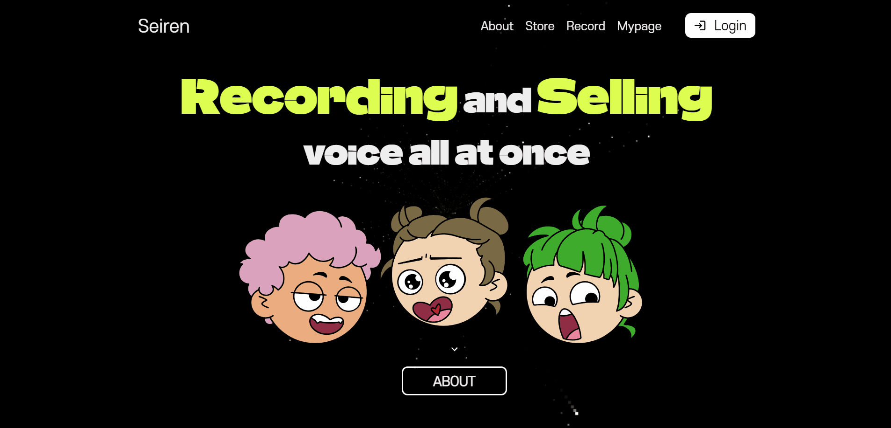|
| :------: | :------: |
| **Main Page** | **Login Page** |
|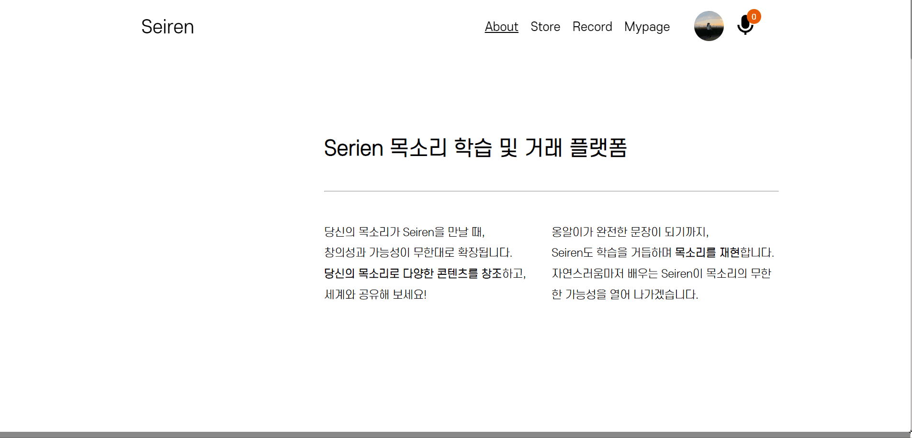||
| **About Page** | **About Page** |

- 메인 페이지에서 대표 캐릭터와 canvas를 활용한 배경을 보여줍니다.
- 어바웃 페이지는 gsap을 이용한 페이지 전환 효과 및 프로그램 소개 영상을 확인할 수 있습니다.

 

2️⃣ <b>스토어 페이지</b>

|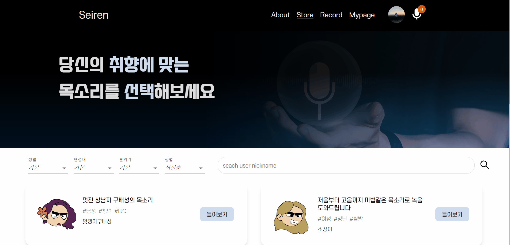|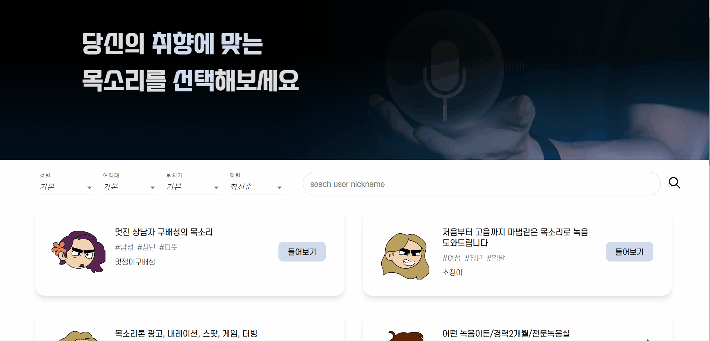|
| :------: | :------: |
| **Store Page** | **Filter** |
||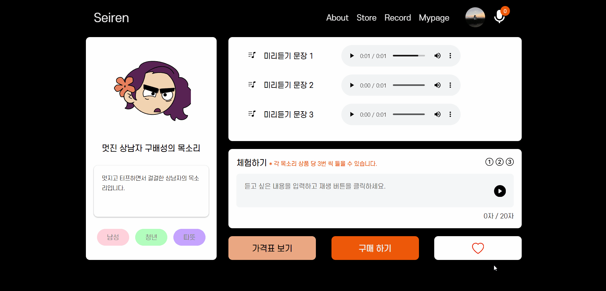|
| **Product Detail** | **Product Test** |
|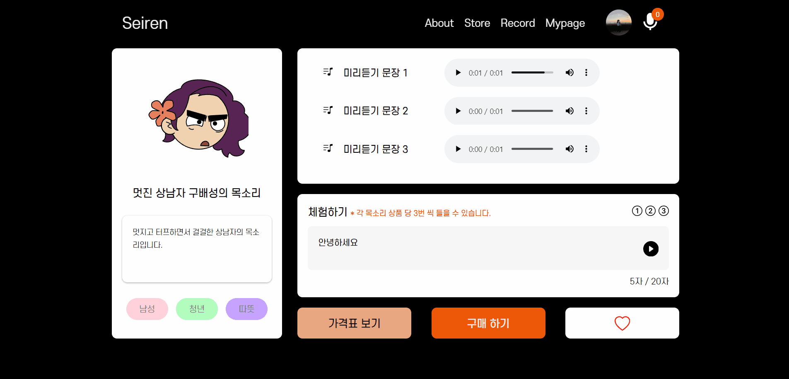||
| **Purchase Page** ||

- 스토어 페이지에서는 사용자의 목소리 상품을 최신순을 기본으로 확인할 수 있습니다.
- 성별[남 여], 연령대[유아..청년], 분위기[다정..우울], 정렬[판매순 최신순] 등 본인이 원하는 목소리에 맞게 상품을 필터링할 수 있습니다.
- 상품 디테일 페이지에서 미리듣기 세문장을 제한 없이 들을 수 있습니다.
- 본인이 듣고 싶은 문장을 텍스트로 입력해 최대 20자, 최대 3번의 제한을 두어 들어볼 수 있습니다.
- 구매 페이지에서 구매 글자 수와 구매 목적을 선택하고 구매할 수 있습니다.

 

3️⃣ <b>레코드 페이지</b>

|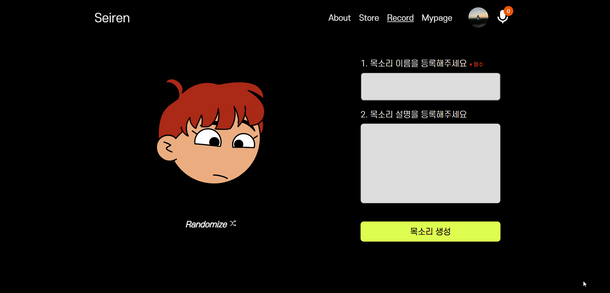|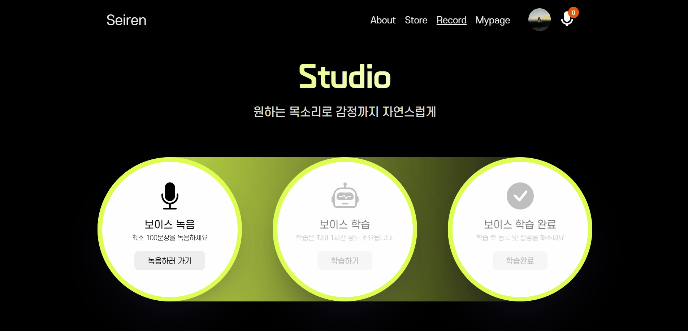|
| :------: | :------: |
| **No Voice** | **Record Page** |
|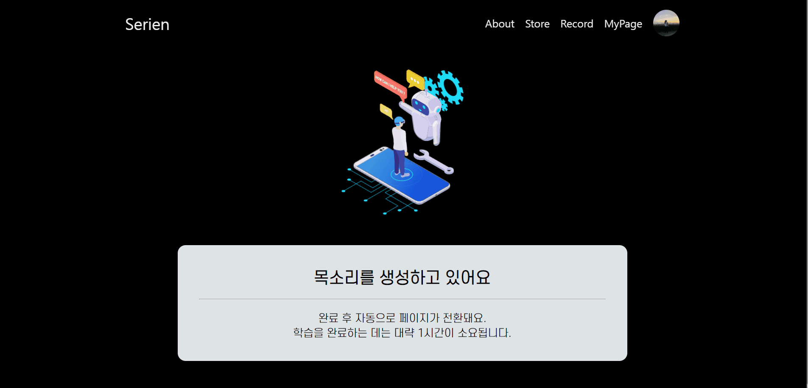|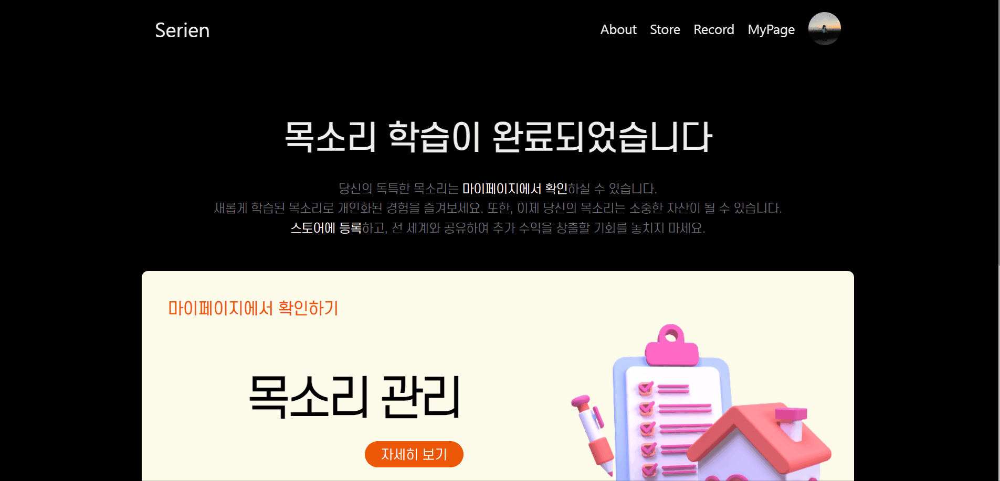|
| **Voice Studying Page** | **Voice Finish Page** |
|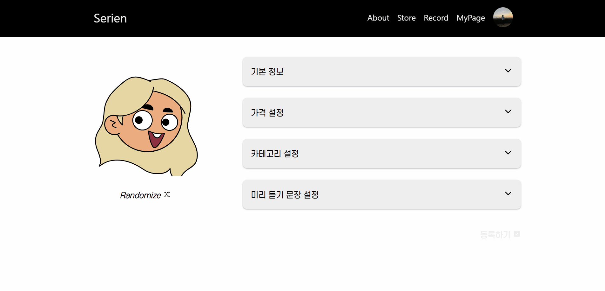||
| **Product Custom Page** ||

- 녹음 중인 목소리가 없을 때는 목소리 등록 페이지로 이동하여 제목과 설명 및 캐릭터를 설정하여 등록합니다.
- 녹음 페이지에서 Seiren이 제공하는 스크립트를 바탕으로 녹음을 진행하고 재녹음이 가능합니다.
- progress bar와 음성 개수를 통해 파악이 가능하며, 100개의 음성 녹음이 진행이 되면 목소리 생성 버튼을 눌러 AI 목소리 생성이 가능합니다.
- 완성된 AI 목소리를 마이페이지에서 확인이 가능할 수 도 있고, 곧바로 상품 등록을 할 수 있습니다.
- 상품 등록 페이지에서는 처음에 작성한 제목, 설명을 기반으로 수정이 가능하며 추후 상품 페이지에서 사용될 카테고리 등록 및 미리 듣기 문장을 최대 20자로 등록합니다.

 

3️4️⃣ <b>마이 페이지</b>

|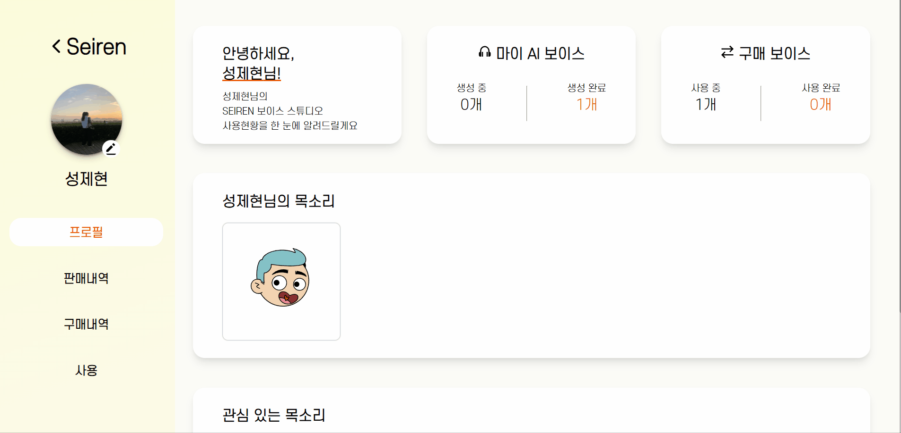||
| :------: | :------: |
| **Profile Page** | **My Voice Detail** |
|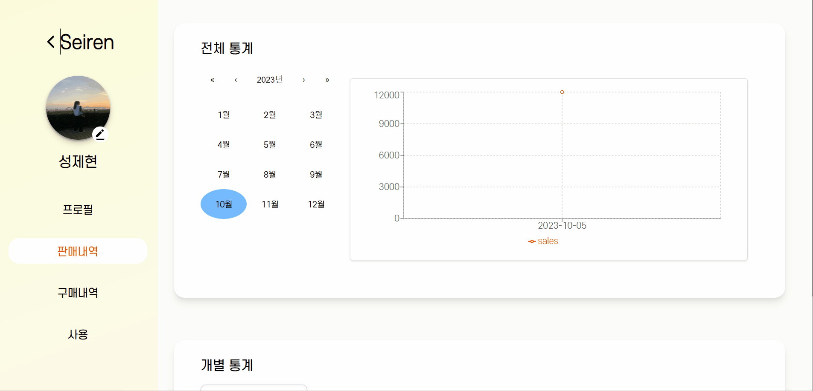|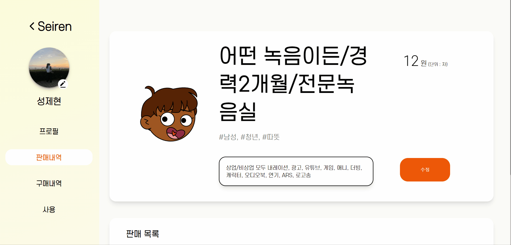|
| **SellList Page** | **Sell Detail** |
|||
| **BuyList Page** ||
|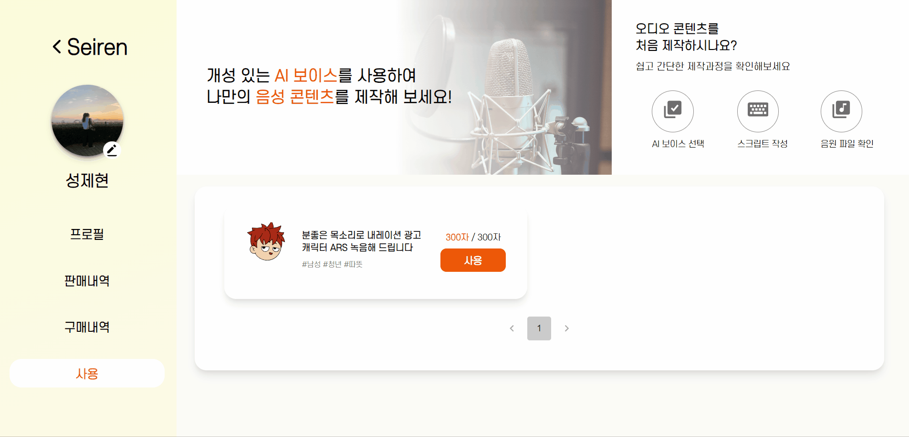|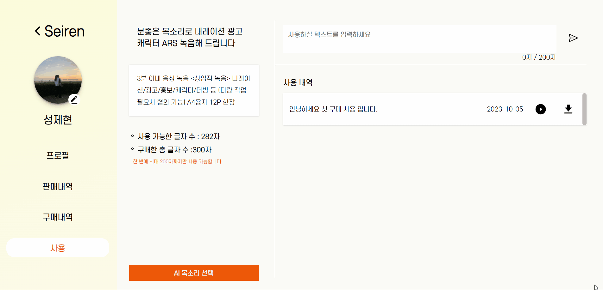|
| **UseList Page** | **VoiceUse Detail** |

- 마이페이지는 크게 프로필, 판매내역, 구매내역, 사용으로 사이드 탭을 통해 이동이 가능합니다.
- 프로필
  - 상단에서 본인이 제작한 AI 보이스의 개수와 구매 보이스의 개수를 볼 수 있습니다.
  - 본인의 목소리를 관리할 수 있으며, 관심 있는 목소리를 클릭하여 상품 디테일로 이동이 가능합니다.
- 판매내역
  - 전체 통계는 월별로 판매 금액을 기준으로 그래프 변화를 실시간으로 확인할 수 있습니다.
  - 개별 통계에서는 각 목소리별 판매 내역을 [구매일자 | 닉네임(구매자) | 목적 | 개수 | 총 금액]을 실시간으로 확인할 수 있습니다.
- 구매내역
  - 통장 내역처럼 본인이 산 목소리의 리스트를 표로 보여주며 총 금액을 실시간으로 확인할 수 있습니다.
- 사용
  - 본인이 구매한 전체 글자 수와 사용 가능한 글자 수를 확인할 수 있습니다.
  - 개별 AI 목소리에 대한 기본 정보 확인과, 본인이 사용할 문장을 한번에 최대 200자 작성이 가능합니다.
  - 사용 내역에서 본인이 입력한 문구를 실시간으로 들어볼 수 있으며, 다운로드 버튼을 통해 음성 파일 내려받기가 가능합니다.

 

## 4. 기술 소개

#### 1. AI-VOICE 생성
- Vits 모델을 사용하여 AI-VOICE 생성
- 대용량의 음성데이터를 사용해 직접 Pretrained model 구축
- Fine Tuning을 통한 parameter 미세조정을 통해 적은 량의 데이터로도 양질의 Voice 생성 가능
- 다발적 AI-Voice 학습 가능
- 100문장의 음성 파일(약 7~8분 분량)과 40분의 학습 시간을 통해 학습이 가능

#### 2. Store 기능
- 생성된 AI-Voice 모델 (글자단위) 판매 및 구매 가능
- 타인의 AI-Voice 모델 구매 가능 (글자단위)
- 생성한 TTS 다운로드 및 바로듣기 가능

#### 3. 역동적 디자인
- GSAP 및 canvas를 이용한 애니메이션 추가

#### 4. 카카오 로그인
- OAUTH2 인증을 이용해 불필요한 개인정보 입력 최소화

 

## 5. 설계 문서
#### ○ 요구사항 명세서
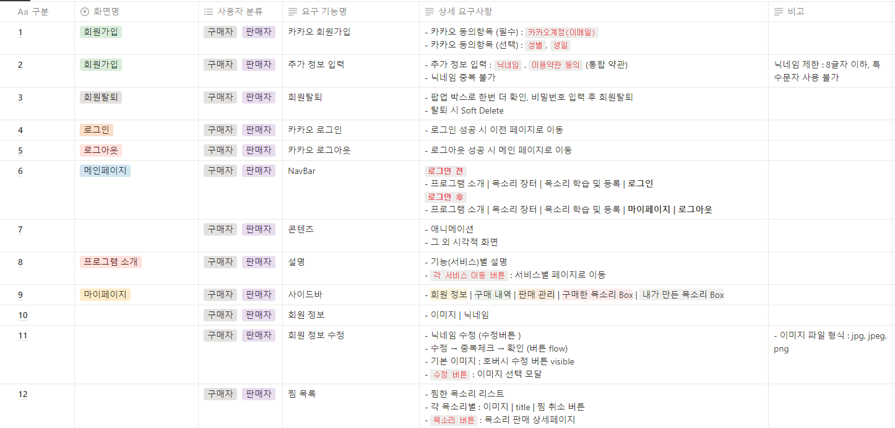
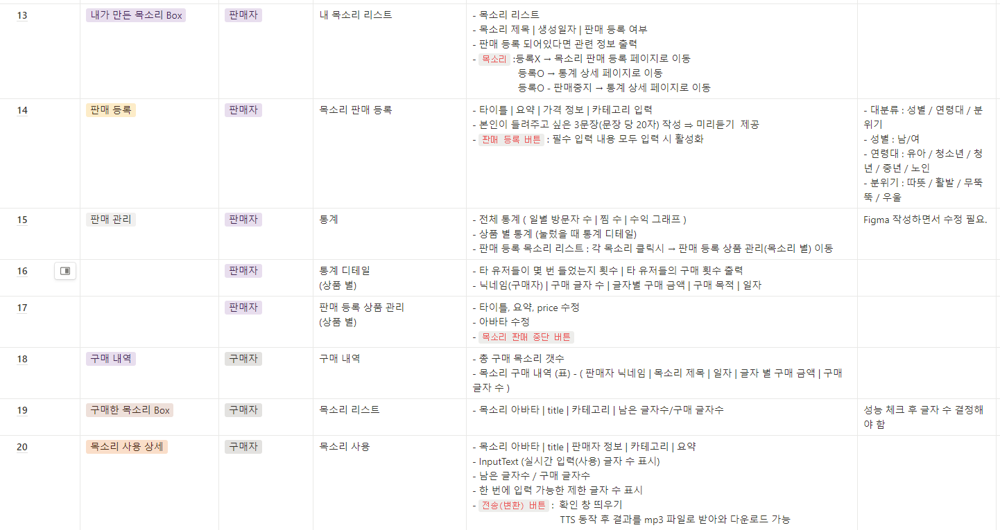
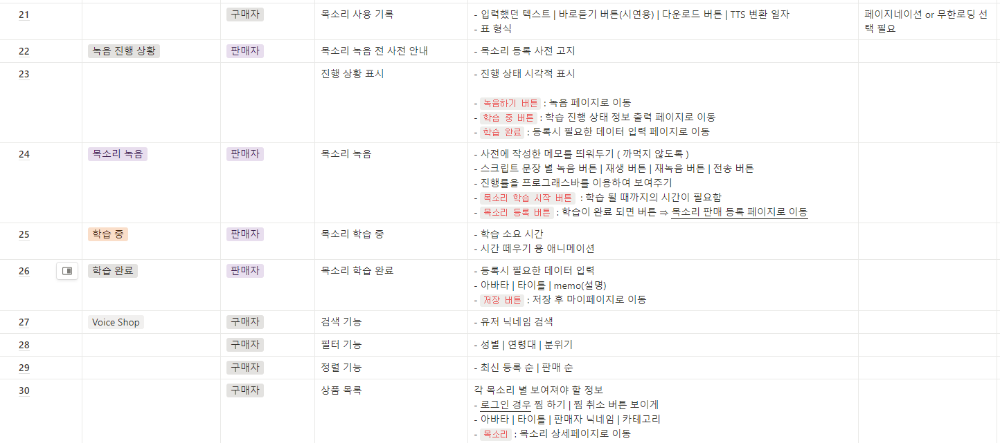
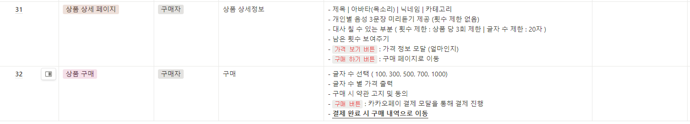

#### ○ API 명세서
- <b>Swagger</b>
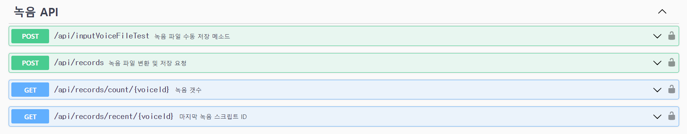
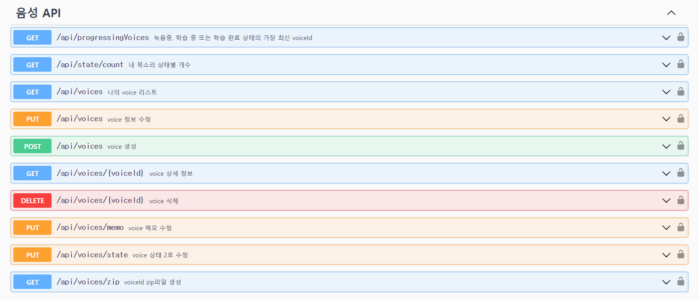
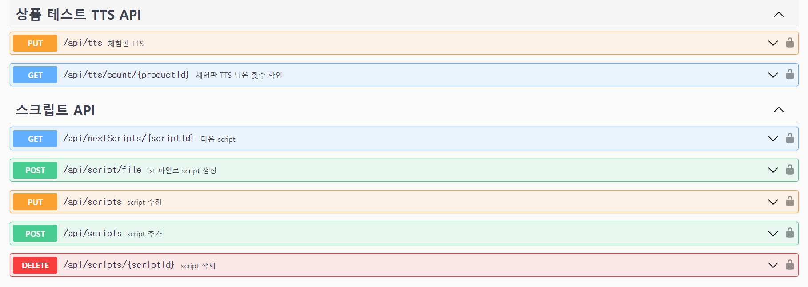
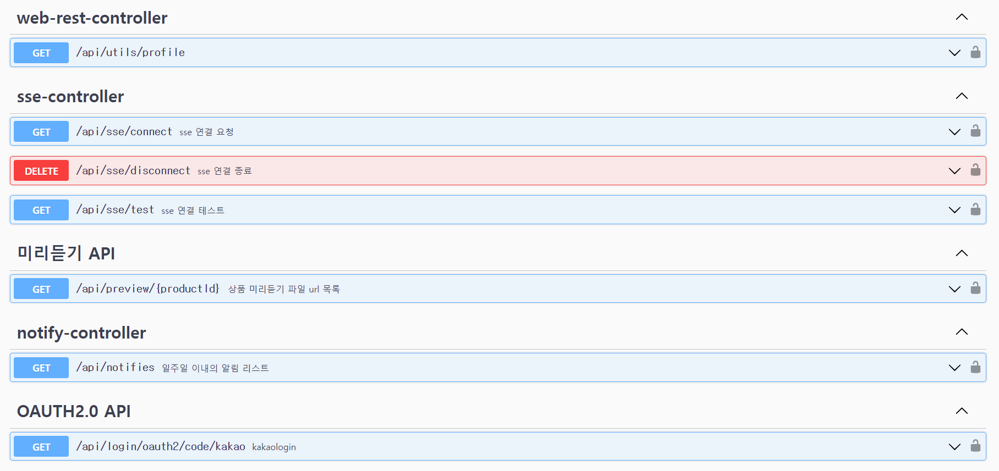

- <b>API 명세서</b>
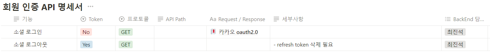
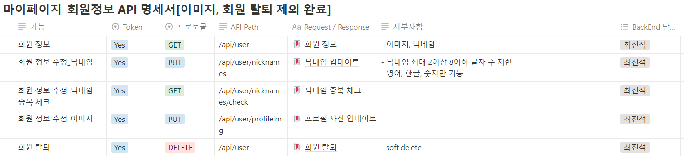
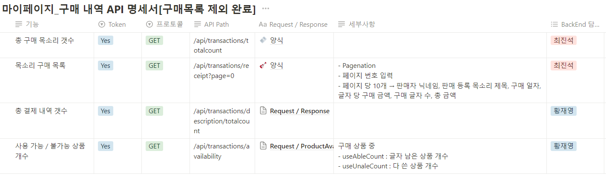
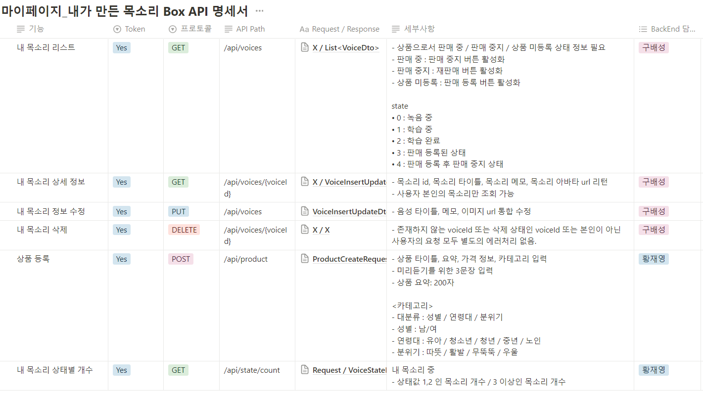
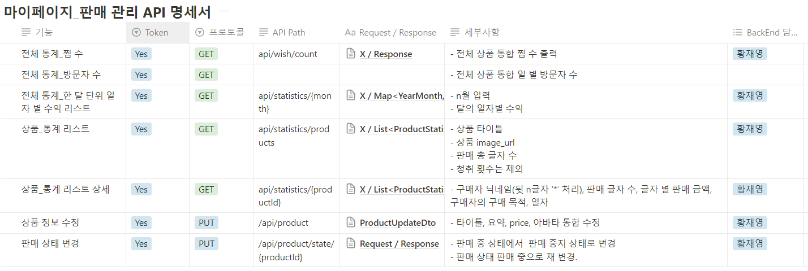
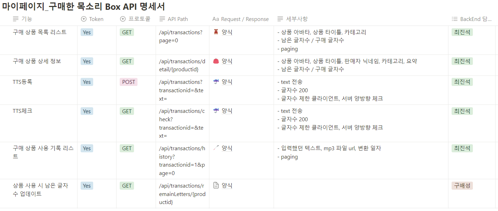
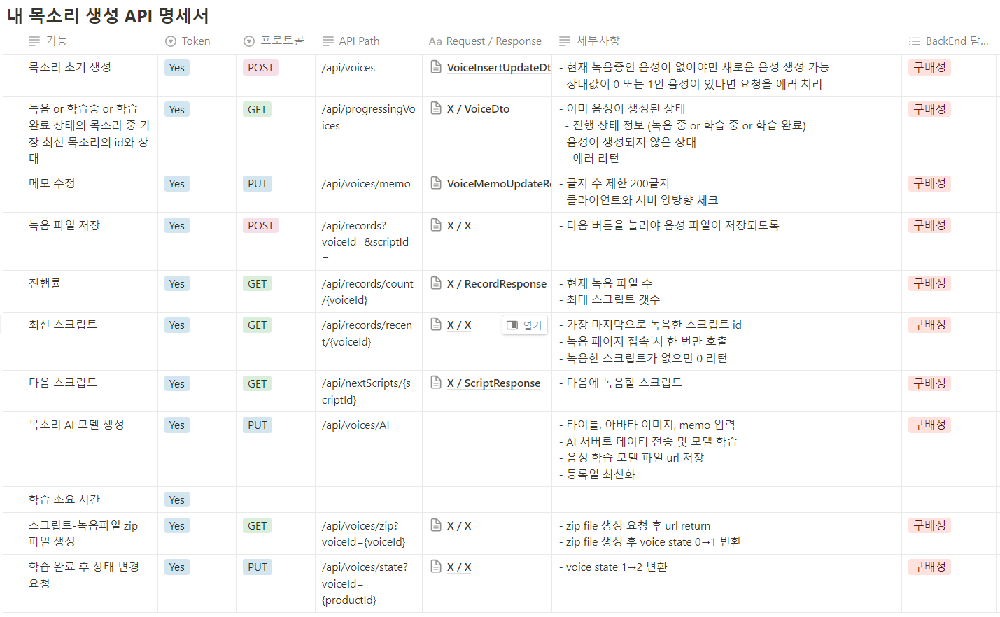

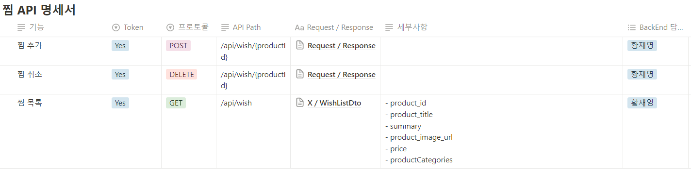
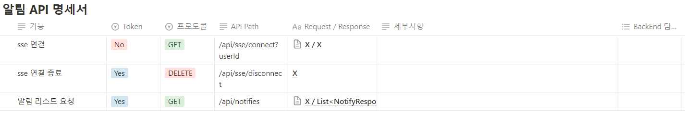
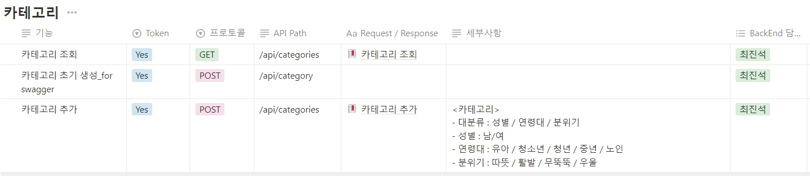
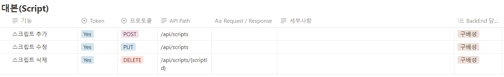
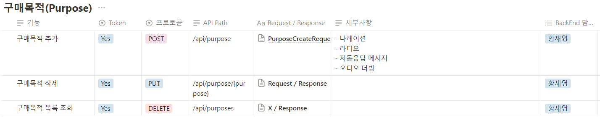

#### ○ ERD 및 시스템 아키텍쳐
<table>
  <tr>
    <td style="text-align:center;">
      
    </td>
    <td style="text-align:center;">
      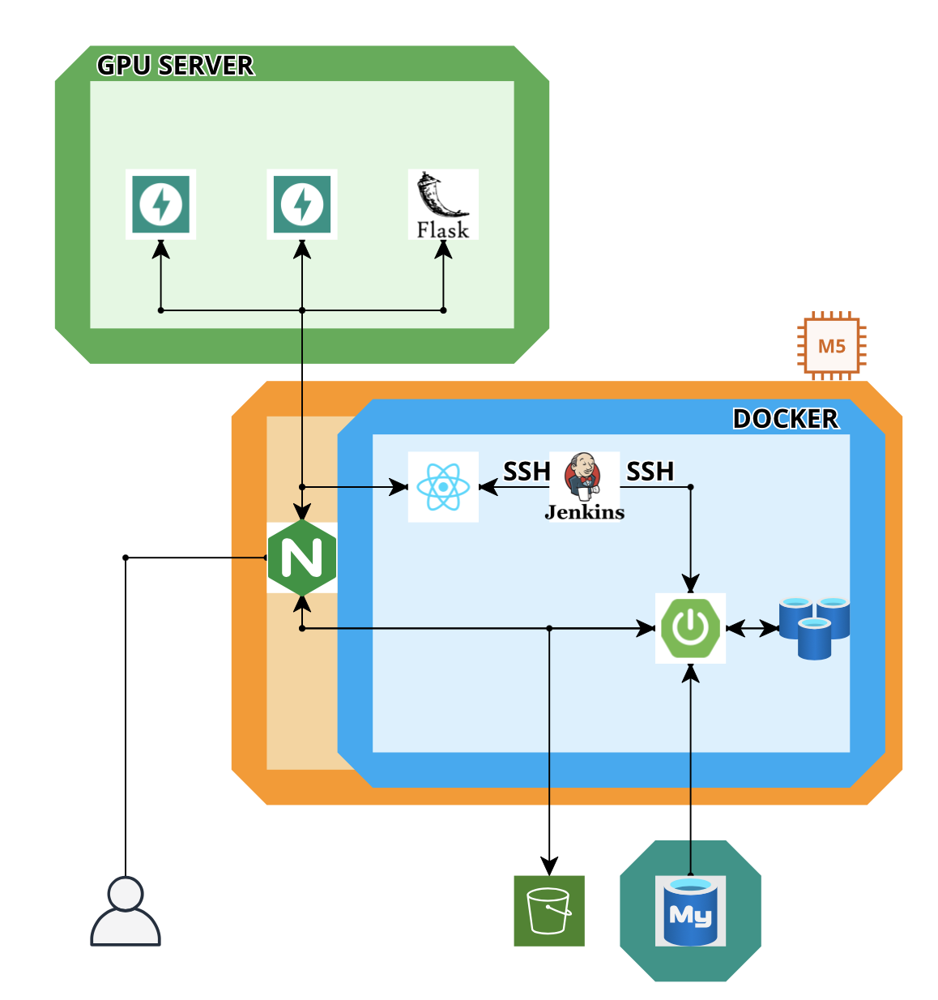
    </td>
  </tr>
</table>

 

## 6. 팀원 소개

| **[성제현](https://github.com/protofu)**|**[정소정](https://github.com/sojeong025)**|**[최진석](https://github.com/choiapple)**|**[구배성](https://github.com/deerKBS)**|**[황재영](https://github.com/JJaeki)**|**라동엽**|
|:---:|:---:|:---:|:---:|:---:|:---:|
|  |  |  |  |  |  |
|Frontend|Frontend|FullStack|FullStack & CI/CD|Backend|AI|

- **성제현** : UX/UI 설계 / 마이페이지 제작 및 api / 문서화 작업 / 빌드 및 오류 수정

- **정소정** : UX/UI 설계 / PPT 및 영상 제작 / 발표 / 디자인 총괄 / Record 및 상품 관리

- **최진석** : API 제작 / front api 연결 / 오류 수정 / DB 설계

- **구배성**: API 제작 / CI/CD 담당 / 영상 제작 / Front 배포 오류 수정

- **황재영** : API 제작 / 검색 기능 제작 / DB 관리

- **라동엽** : Flask 서버 구축 / AI 학습 모델 생성 
