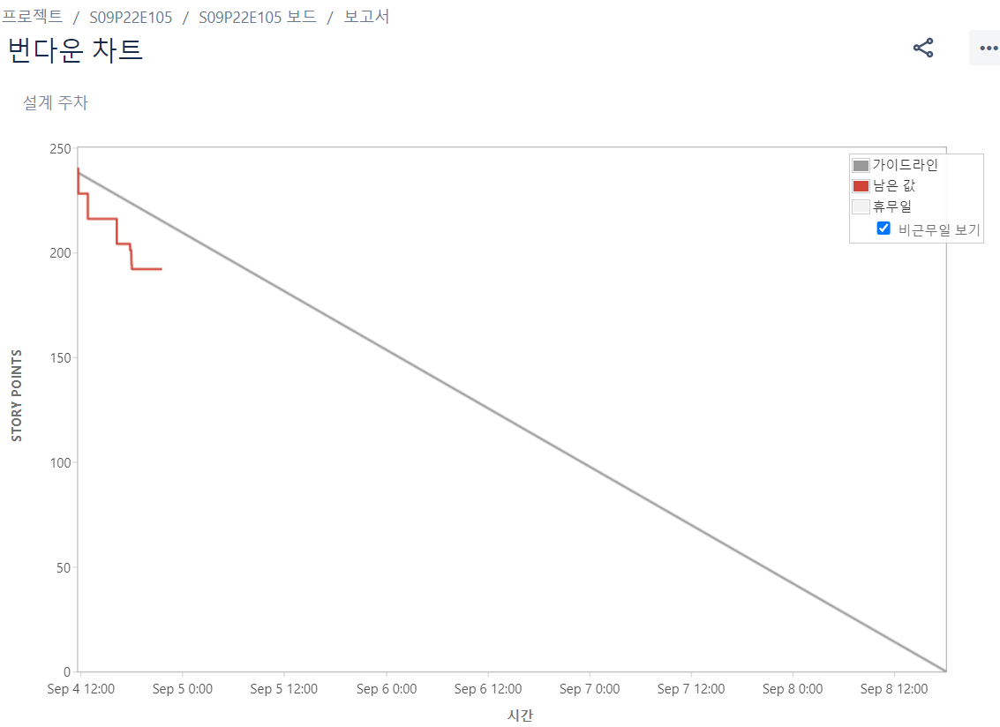

# 프로젝트에 관한 전체 진행 과정 및 회고입니다.

# 1 weeks

## 2023 / 08 / 28 [월]

### 프로젝트 기획 회의
 - 인공지능에 대한 이해 
.png>)
### 아이디어 
- 시각장애인 화상회의 표정분석, 수화 번역 - 사회공헌 바이브

- 맞벌이 부부, 아기 집에 있어야 함 (홈 캠) 영상 제공 뿐 아니라 얼굴 인식으로 분석해서 약간 그 느낌 - 비 언어적인 그걸로 심리 상태를 알 수 있는 서비스

- [극한 소음 음성인식 데이터](https://www.aihub.or.kr/aihubdata/data/view.do?currMenu=115&topMenu=100&aihubDataSe=realm&dataSetSn=71417)

- [인공지능 아이디어](https://bodeveloper.com/%EC%9D%B8%EA%B3%B5%EC%A7%80%EB%8A%A5-%EC%96%B4%EB%94%94%EC%97%90-%EC%93%B0%EC%9D%B4%EB%82%98-%EA%B6%81%EA%B8%88%ED%95%B4%EC%84%9C-%EC%B0%BE%EC%95%84%EB%B4%84feat-%EC%9D%B8%EA%B3%B5%EC%A7%80%EB%8A%A5/)

- [AI 머신러닝](https://github.com/ashishpatel26/500-AI-Machine-learning-Deep-learning-Computer-vision-NLP-Projects-with-code)

- OCR 책 표지로 구분하여 ⇒ 도서관에서 자동으로 등록 빠르게(책 정보를)

### 첫 팀 미팅
- 팀 방향성 결정 및 역할 분배

### 깃 컨벤션, 플로우 회의
- 제목은 최대 50글자까지 아래에 작성: ex) Feat: Add Key mapping  
```
<타입> 리스트  
feat        : 기능 (새로운 기능)  
fix         : 버그 (버그 수정)  
refactor    : 리팩토링  
design      : CSS 등 사용자 UI 디자인 변경  
comment     : 필요한 주석 추가 및 변경  
style       : 스타일 (코드 형식, 세미콜론 추가: 비즈니스 로직에 변경 없음)  
docs        : 문서 수정 (문서 추가, 수정, 삭제, README)  
test        : 테스트 (테스트 코드 추가, 수정, 삭제: 비즈니스 로직에 변경 없음)  
chore       : 기타 변경사항 (빌드 스크립트 수정, assets, 패키지 매니저 등)  
init        : 초기 생성  
rename      : 파일 혹은 폴더명을 수정하거나 옮기는 작업만 한 경우  
remove      : 파일을 삭제하는 작업만 수행한 경우  
```
### 번다운차트
.png>)


------------------------------------------------------------------------------------------------------------------

## 2023 / 08 / 29 [화]

### 프로젝트 기획 회의
- 인공지능을 이용한 가계금융건강검진

- 친환경 농업을 위한 AI 예측 시스템

- 재난 예측 및 대응 AI 시스템

- 이커머스 (아이트레킹을 통한 사용자 데이터 수집 및 추천 서비스)

- 로고 자동 모자이크

### 기술 회의
- [아이트레킹](https://github.com/sho-87/webcam-eye-tracker)

- [pix2pix](https://github.com/timothybrooks/instruct-pix2pix/tree/main)

- [릴루미노](https://news.samsung.com/kr/%EC%82%BC%EC%84%B1%EC%A0%84%EC%9E%90-%EC%B0%A9%ED%95%9C-%EA%B8%B0%EC%88%A0-%EB%A6%B4%EB%A3%A8%EB%AF%B8%EB%85%B8-%EA%B8%80%EB%9E%98%EC%8A%A4-%EC%8B%9C%EB%B2%94-%EB%B3%B4%EA%B8%89)

- [airdraw](https://github.com/arefmalek/airdraw)


### 취업특강
- 1Hour


------------------------------------------------------------------------------------------------------------------

## 2023 / 08 / 30 [수]
### 프로젝트 기획 회의
- [생활 속 인공지능](https://baboppak.com/entry/%EC%83%9D%ED%99%9C%EC%86%8D%EC%9D%B8%EA%B3%B5%EC%A7%80%EB%8A%A5%EC%82%AC%EB%A1%80100%EC%84%A0)

- [ProgrammingHut 참고 사이트](https://www.youtube.com/@programming_hut/videos)

- [인공지능 결과물 모음](https://smhrd.or.kr/project/show/bigdata/#TabCtt)

- CS 면접 AI
 
- 교권 침해 방지 시스템

- 로드맵을 만들어주는 op.gg
    - 유저들의 목표가 비슷할 경우 평균치를 통해 진행 상태 파악할 수 있도록

    - 대주제를 정하면 세부 목표도 추천

    - 목표를 완수했을 경우 추후 새로운 목표를 통계적으로 추천해줌

    - 핵심은 문장과 문장의 유사도를 평가 ⇒ kobert 모델
        - 문장을 넣으면 Vector 값으로 변환 후 Vertor 값끼리 비교
        
    - 문제점 : 초기 데이터 설정 + 성취도 및 진행도 기준 설정
.png>)

### 기술 회의
- [VisionCraft](https://github.com/diStyApps/VisionCrafter)

- [airdraw](https://www.youtube.com/watch?v=ZiwZaAVbXQo)

- [자연어 처리에 관한..](https://littlefoxdiary.tistory.com/42)

- [문장 유사도 평가](https://github.com/kakaobrain/kor-nlu-datasets/tree/master)

- [두 개의 질문이 같은 질문인지 아닌지 레이블링한 데이터(학습 6,888건 / 테스트 688건 제공)](https://github.com/kakaobrain/kor-nlu-datasets/tree/master)

- [질문쌍](https://github.com/songys/Question_pair)

------------------------------------------------------------------------------------------------------------------

## 2023 / 08 / 31 [목]

### 프로젝트 기획 회의
- 목표 로드맵
    - 유저들의 목표가 비슷할 경우 평균치를 통해 진행 상태 파악할 수 있도록
    - 큰 목표를 설정하면 세부 목표 추천
    - 목표를 완수하였을 경우 추 후 새로운 목표를 통계적으로 추천

- 스마트 팜[식물 통합 관리 플랫폼]
    - 나무/새와/포트식물 종류에 따라 관리법이 다름
    - 각각을 모델링하여 스마트하게 관리
    - 환경정보(온도, 상대습도, 광량, 이산화 탄소, 토양 등)

- 유튜브 Index를 통한 영상 요약

- AirDraw
    - AI hand pose estimate 기술, 웹 캠을 이용한 AirDraw 기능
    - pix2pix 기술을 AirDraw 기술에 접목해 이미지 변환 가능

- 블랙박스 영상을 통한 차량 이동 경로 유추 시스템
    - 수많은 블박 영상에서 정보를 수집 (시간, 차종 or 차 번호, 위치)
    - 수집한 정보를 바탕으로 블박 영상에서 등장했던 차량의 이동경로 유추

- AI기반 맞춤형 에너지 소비
    - 같은 평수의 사람들은 전기세를 얼마나 사용하는지
    - 전기를 아끼는 방법들을 공유 → 전기세가 많이 나오는 사람들에게 추천
    - 전기 아끼는 방법 가이드라인 제시

- 외국인 맞춤형 한국 관광 서비스
    - 한국 전시회 및 미술관에서 도슨트 번역 버전

- 대신 답장해주는 서비스
    - 코드 스니펫 처럼 자동완성 기능을 좀 더 업그레이드

### META AI 체험, 자료조사
- [META AI 체험](https://huggingface.co/spaces?sort=likes)

### 팀미팅
- 인공지능(음성) 팀 인데 너무 영상 위주로 돌아간다.

- airdraw와 음성 시스템을 합친 서비스를 생각해보면 좋겠다.

- 음악 관련으로 AI 작곡 시스템

- airdraw 기술을 사용해서 키보드나 마우스를 이용하기 어려울 때 손의 움직임만으로...

### 번다운차트


------------------------------------------------------------------------------------------------------------------

## 2023 / 09 / 01 [금]

### 프로젝트 기획 회의

### 번다운차트


### KPT
- Keep
    - 활발한 소통과 여러 아이디어를 공유하는점 피드백을 하는점
    - 다양한 레퍼런스 및 사용법을 찾아보는 팀원들이 많은 점
    - 냉철한 피드백을 해줄 곳은 해주는 점
    - 소통이 활발하고 쉴 때와 해야할 때를 명확히 구분하여 효율이 좋았다.
    - 적극적인 회의 참여와 피드백
    - 활발하게 의사소통 하는 점
    - 편안하게 아이디어를 낼 수 있는 분위기. 어떤 아이디어를 내더라고 다정하게 피드백

- Ploblem
    - 조금 더 다정하면 좋을 것 같다.
    - 신박한 아이디어라 생각했지만 이미 싸피에서 진행이 되었던 점
    - 아이디어를 도출한 후 그 아이디어가 존재한다고 알게 되면 다들 시무룩해지는 점을 조금 고쳐야 할 것 같다.
    - 예상보다 늦춰진 주제 선정
    - 아이디어 선정이 생각보다 오래 걸린다.
    - 급격한 체력저하

- Try
    - 부드러운 언어와 친절함
    - 상냥한 말투
    - 우리가 더 잘해보면 된다는 점
    - 다양한 기술들을 찾아보며 모두 접목시키기 보다 핵심적 기능을 생각하며 필요한 기능에 도움이 되는 것을 생각하면 더 좋을 것 같다.
    - 창의적이진 않지만 목적과 이유가 확실한 아이디어 선정을 하고 명확한 차별화를 통한 아이디어 선정
    - 부드러운 언어로 상냥하게 말하지
    - 자신감 가지기!

------------------------------------------------------------------------
# 2 weeks

## 2023 / 09 / 04 [월]

### 프로젝트 기획 회의
- [한국어 존댓말/반말 분류 모델](https://acdongpgm.tistory.com/332)
- [다글로](https://daglo.ai/)
- [Voli.ai](https://voli.ai/#STS)
- [아이디어 공모전](http://www.ai-idea.co.kr/list.asp?boardcode=notice)
- [Boostcamp](https://m.blog.naver.com/boostcamp_official/222931879326)

### 아이디어 
- [오타 교정기](https://acdongpgm.tistory.com/354)
- [존댓말 변환기](https://acdongpgm.tistory.com/355)
- 스피치 노트
- 작곡 서비스

### 번다운차트
